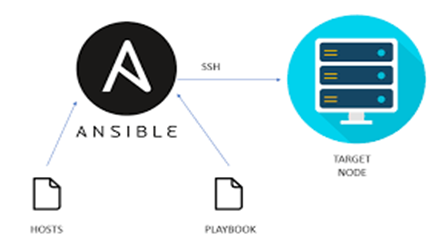
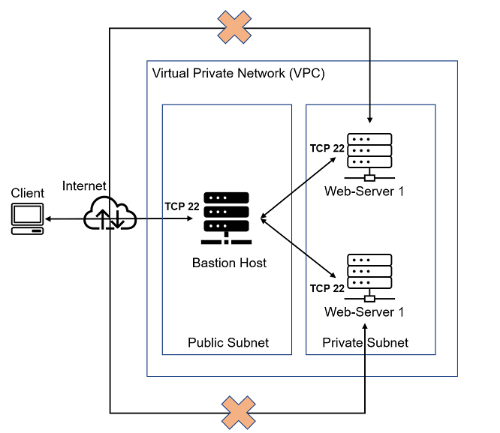

<<<<<<< HEAD
# ansible-config-mgt

Test page on Jenkins
=======
# ansible-config-mgt

Test page on Jenkins

Test connection
>>>>>>> origin
>>>>>>>
>>>>>>> 
Continue with project 12
on the same git hub repo
reconfigure jenkins to reflect on git hub

# Implementation Of Ansible For Automation

** Introduction To Ansible ** 
### Ansible provides open-source automation that reduces complexity and runs everywhere. Using Ansible lets you automate virtually any task. 

## What is Ansible:
### : Ansible is a powerful open-source automation tool used for configuration management, application deployment, and orchestration in DevOps workflows. Benefits of Ansible are Free, very simple to set up and use, Powerful, Flexible, Agentless, and Efficient. 

## Here are some common use cases of Ansible:

-	Ansible Eliminate repetition and simplify workflows
-	Ansible Manage and maintain system configuration
-	Ansible Continuously deploy complex software
-	Ansible Perform zero-downtime rolling updates
- Ansible uses simple, human-readable scripts called playbooks to automate your tasks. You declare the desired state of a local or remote system in your playbook. - - - Ansible ensures that the system remains in that state.

## Importance of ansible in Automation: 

- One of the main benefits of Ansible automation is that it eliminates the need for manual configuration, which can be time-consuming and error-prone. 
- With Ansible, IT teams can create playbooks that define the desired state of their infrastructure and automate the process of bringing it to that state.

## Target Audience: 
### This topic is designed for architects and system administrators who are responsible for deploying and configuring an IBM Blockchain Platform

## Project Prerequisites: 

 - Basic understanding of Linux systems and command-line usage.

- Better understanding of SSH and basic server administration.
- AWS EC2 access
- A computer running Ubuntu  or a Linux virtual machine.
- Ansible installed on your local machine or server. 

## Project Goals
- To understand the fundamentals of Ansible 
- To become proficient in writing Ansible playbooks for automation.
- To automate some devops tasks and responsibilities
- To deploy and manage applications using Ansible. 
- improving efficiency and scalability in an IT operation.
Ansible-client-jump as jump-server

## Step1: 
1. Install and Configure Ansible on EC2 Instance.

2. Launch an instance on Ec2 and name it Jenkins_Ansible.

3. Connect Ansible via ssh to your terminal

4. Then we will install and configure Jenkins and Ansible on the instance created.

5. Create a new repository on git hub call ansible-config-mgt.

6. Launch an instance on Ec2 and name it for 2 webservers, Loadbalancer (ubuntu) Database and NFS

6.  This repository will be connected to jenkins pipeline and store ansible files.

7. Install Ansible by running below command

‘sudo apt update’

‘sudo apt install ansible’

### Confirm that ansible is successfully installed by running this command

‘ansible –version’

**Step 2:**

### Configure Jenkins Build Job To Archive our Repository Content Every Time Its Changed. 

[alt text](<image/Jenkins-ansible conf 2.png>)

### To create a build job, first thing is to install and configure Jenkins on the same server that we have ansible

### On the same server we need to install jenkins *** Update package repositories by running this command.

### Installation of Jenkins by running command
'sudo wget -O /usr/share/keyrings/jenkins-keyring.asc \
  https://pkg.jenkins.io/debian-stable/jenkins.io-2023.key
echo "deb [signed-by=/usr/share/keyrings/jenkins-keyring.asc]" \
  https://pkg.jenkins.io/debian-stable binary/ | sudo tee \
  /etc/apt/sources.list.d/jenkins.list > /dev/null'

'sudo apt-get update'
'sudo apt-get install jenkins' 
'sudo apt update'
'sudo apt install default-jdk-headless' 'sudo systemctl status Jenkins'

### Check if jenkins has been installed, and it is running with this command

‘sudo systemctl status jenkins’

### On  Jenkins-Ansible instance, 

### Create add new inbound rules by open port 8080 in security group

### Jenkins set up
1. input your Jenkins-Ansible Instance public IP address on the web browser,

[public IP](http://public_ip_address:8080)

2. On our Jenkins-Ansible instance, check 
'/var/lib/jenkins/secrets/' on the teminal using
 'cat /var/lib/jenkins/secrets/'

### initial AdminPassword" to know our password.

### Our Jenkins public IP is 3.17.140.105

### Input 3.17.140.105:8080 on our url, press enter.

'Sudo Cat /var/lib/jenkins/secrets/'

### initialAdminPassword to get admin

### Password will be displayed, copy and keep on a writing pad.

### Install necessary plugin

### First admin user page will be displayed, supply required information.

### Complete Jenkins setup by clicking continue and finish the installation.

### We shall see welcome to Jenkins dashboard where we can log into Jenkins console.

### Configure Jenkins and copy github url and archive the artifact.

### Then click on build, then refresh, we will see ansible building.

### Go to git hub and effect a change like test page on Jenkins

### Commit a change with a commit message

### Then go to ansible and click on dropdown menu, select console output

### You will see that a new build has been launched automatically by webhook on github and we can see the results – artifacts, saved on Jenkins serve

r.

**Step 3 **  
### We can now Prepare our development environment using Vs Code

### On vsc install remote development.

### Then clone our ansible-config-mgt repo to our Jenkins-Ansible instance.

### Run the following 

‘Git clone https://github.com/IBK-DevOPs/ansible-config-mgt.git’

### On our github repo we create a new branch call prj-ansj

### Run below code
‘git checkout -b prj-ansj’
### Checkout the newly created feature branch to your local machine and start building

** Step 4**
### Then start building on the branch created 
### Create a directory and name it playbooks 

- it will be used to store all your playbook files.

### Create a directory and name it inventory - it will be used to keep your hosts organised.

### Within the playbooks folder, create your first playbook, and name it common.yml

'mkdir playbooks'
'mkdir inventory'
### create below file in the inventory

"touch dev.yml, staging.yml, uat.yml, prod.yml'

### Run below code
‘git checkout -b prj-ansj’

### Checkout the newly created feature branch to your local machine and start building

### Then start building on the branch created 

### Create a directory and name it playbooks

- it will be used to store all your playbook files.

### reate a directory and name it inventory - it will be used to keep your hosts organised.

### Within the playbooks folder, create your first playbook, and name it common.yml

### Step 5: Setup Ansible Inventory

### The inventory file is a fundamental concept in Ansible and is used to organize and manage your infrastructure.

### We need setup our ssh keys for ansible so it can have access to our host (remote servers) when running playbooks for our hosts.

### ssh into our vscode

### This can be done using an SSH agent. An SSH agent allows you to securely store and manage your SSH private keys and provides a convenient way for ansible to authenticate with remote hosts without repeatedly entering your SSH key

'eval `ssh-agent -s`

'ssh-add <path-to-private-key>'

### Confirm the key has been added with the command below, you should see the name of your key

‘ssh-add -l’ 

### Since we have our SSH key for our host stored with SSH agent so ansible can use this, ansible also need to know the host to manage. We can do this with an inventory file
### Ssh into Jenkins ansible

‘Run ssh -A ubuntu@public IP(Jenkins-ansible)'

### This will take us into the server

### We can test the key by running this command

‘ssh-add -l’

### It will show our pem key.

### Open the inventory/dev.yml file we created earlier

### Paste the below information on it

‘[nfs] ‘
‘<NFS-Server-Private-IP-Address> ansible_ssh_user=ec2-user‘ 

‘ [webservers‘]
‘<Web-Server1-Private-IP-Address> ansible_ssh_user=ec2-user‘
‘<Web-Server2-Private-IP-Address> ansible_ssh_user=ec2-user‘

‘ [db] ‘
‘<Database-Private-IP-Address> ansible_ssh_user=ec2-user‘ 

‘ [lb] ‘
‘<Load-Balancer-Private-IP-Address> ansible_ssh_user=ubuntu‘

### It will become below data

'[nfs]
172.31.19.7 ansible_ssh_user=ec2-user

[webservers]  
ansible_ssh_user=ec2-user
172.31.21.135 ansible_ssh_user=ec2-user

[db]
172.31.28.195 ansible_ssh_user=ec2-user 

[lb]
172.31.24.191 ansible_ssh_user=ubuntu'

### Step 6: - Create a Common Playbook

### It is time to start giving Ansible the instructions on what we need to be performed on all our servers listed in inventory/dev.

### In common.yml playbook you will write configuration for repeatable, re-usable, and multi-machine tasks that is common to systems within the infrastructure.

### Update your playbooks/common.yml file with following command:

‘---‘
‘- name: update web, nfs and db servers‘
  ‘hosts: webservers, nfs, db‘
  ‘become: yes‘
  ‘tasks: ‘
   ‘ - name: ensure wireshark is at the latest version
      yum: ‘
        ‘name: wireshark‘
        ‘state: latest‘

‘- name: update LB server‘
  ‘hosts: lb‘
  ‘become: yes‘
  ‘tasks:
    ‘- name: Update apt repo‘
     ‘ apt: ‘
        ‘update_cache: yes‘
‘    - name: ensure wireshark is at the latest version
      apt: ‘
       ‘ name: wireshark‘
        ‘state: latest‘

### Examine the code above and try to make sense out of it. This playbooks is divided into two parts, each of them is intended to perform the same task: install wireshark utility ( make sure it is updated to the latest version) on our RHEL 8 and Ubuntu servers. It uses root user to perform this task and respective package manager: yum for RHEL 8 and apt for Ubuntu.

### We can update this playbook with following tasks:

### We can now Create a directory and a file inside it Change timezone on all servers Run some shell  script

### Step 7 Update GIT with the latest code

### Now all of your directories and files live on your machine and you need to push changes made locally to GitHub.

### In the real world, you will be working within a team of other DevOps engineers and developers. It is important to learn how to collaborate with help of GIT. In many organisations there is a development rule that do not allow to deploy any code before it has been reviewed by an extra pair of eyes - it is also called "Four eyes principle".

### Now we have a separate branch, we will need to know how to raise a Pull Request on our git hub machine (PR), get your branch peer reviewed and merged to the master branch.

### Commit our code into GitHub:

### Use git commands to add, Then commit and push our branch to GitHub.

‘git status‘
‘git add <selected files>‘
‘git commit -m "commit message"‘

### Then we can n
Now push our changes to a remote repositories

‘git push’

### Wear the hat of another developer for a second, and act as a reviewer.

### If the reviewer is happy with your new feature development, merge the code to the master branch on your local computer, commit and push changes we made to our remote repository.

### Once our code changes appear in master branch - Jenkins will do its job and save all the files (build artifacts) to ‘/var/lib/jenkins/jobs/ansible/builds/<build_number>/archive/

### Ansible server as we configured it to in Step 2.

**Step 8**
### Run first Ansible test

### Now, it is time to execute ansible-playbook command and verify if your playbook actually works:
### Setup your VSCode to connect to your instance as demonstrated by the video above. Now run your playbook using the command:

'cd ansible-config-mgt'
### If your playbook is giving the authentication issue  run below command.

### create ansible.cfg  
'touch ansible.cfg'
### Edit ansible config 

### vi into  ansible.cfg'
'host_key_checking = False'

Falsethen change the permission using

'chmod 644 ansible.cfg'

Run below command 
'/var/lib/jenkins/jobs/ansible/builds/number of build/archive'
cd into ansible-config-mgt 
cd /var/lib/jenkins/jobs/ansible/builds/10/archive

Then run 
'ansible-playbook -i inventory/dev.yml playbooks/common.yml' 

'cd /var/lib/jenkins/jobs/ansible/builds/10/archive
ubuntu@ip-172-31-30-183:/var/lib/jenkins/jobs/ansible/builds/10/archive$ ansible-playbook -i inventory/dev.yml playbooks/common.yml'

'ansible-playbook -i inventory/dev.yml'
playbooks/common.yml'

### Side Study
### Learners should look into Ansible Modules to deepen knowledge of ansible playbooks. Ansible Modules are the building blocks of Ansible playbooks, and understanding them is fundamental to working effectively with Ansible.

### check wireshark version

### Ansible Automation is an important tool that can simplify and streamline divers aspects of IT and infrastructure management. 

### This project also covered jenkin for integration. By learning Ansible and Jenkins, we can automate tasks, reduce manual errors, and ensure consistency in your operations.

### Final architecture should  have this look.

![alt text](<image/final ansible -architecture.p

